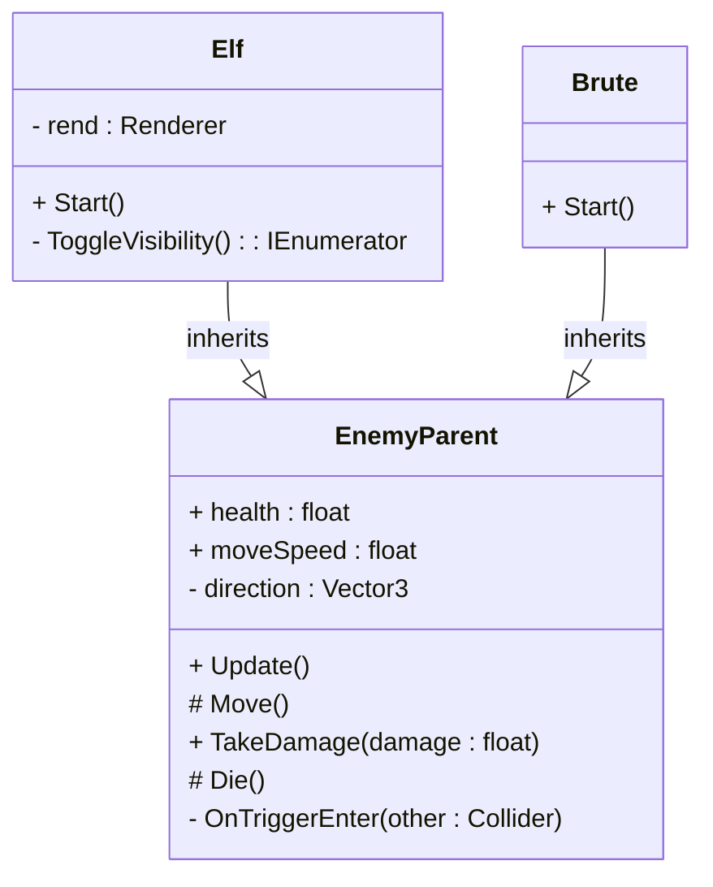
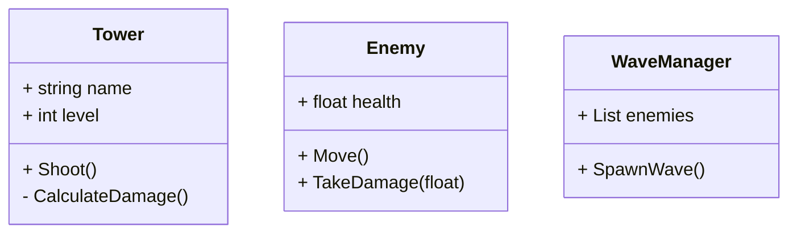
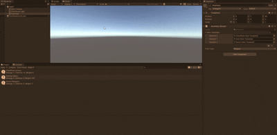
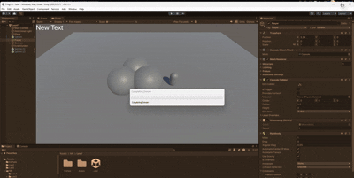
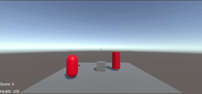
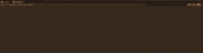

#  Prog-1.5 Lessons & Space48 Project

This repository contains Unity projects and scripts from the **Prog-1.5** course, along with the **Space48** project.  
Each lesson demonstrates key programming concepts such as **DRY (Don’t Repeat Yourself)** and **SRP (Single Responsibility Principle)** in Unity.

---

##  **Lesson 1**
**Assignments:** 1, 2, 3  
**Scripts:** [Les1 Scripts](https://github.com/zmbfiedk/Prog-1.5/tree/main/Assets/Scripts/Les1)  
**Demo:**   

 *In this lesson, we revisited the basics to refresh our understanding of fundamental Unity scripting concepts.*

---

## **Lesson 2**
**Scripts:** [Les2 Scripts](https://github.com/zmbfiedk/Prog-1.5/tree/main/Assets/Les2)  
**Demo:**   

*We explored how **Action Events** work and how to connect them with other scripts and functions to improve communication between game objects.*

---

## **Lesson 3**
**Demo:**   
**Tower Defense Issues:** [Tower Defense Repo Issues](https://github.com/zmbfiedk/Tower-Defense/issues)  

*This lesson focused on identifying dependencies and debugging issues in our Tower Defense project.*

---

## **Lesson 4 — Space48 Project**
**Scripts:** Located in a separate repository  
**Repository:** [Space48](https://github.com/zmbfiedk/Space48)  
**Demo:**   

*In this lesson, we worked on the **Space48** project, which demonstrates the principles of **DRY** and **SRP** through clean, modular code and reusable systems.*

---

##  **Lesson 5**
**Scripts:** [Les5 Scripts](https://github.com/zmbfiedk/Prog-1.5/tree/main/Assets/Les5)  
**Demo:**   

*We practiced **inheritance-based programming**, creating multiple enemy types that share functionality through a common base class.*

---

## **Lesson 6**
**Project:** [Tower Defense Repository](https://github.com/zmbfiedk/Tower-Defense)  

 *In the final lesson, we mapped out and documented all **dependencies** in our Tower Defense project to better understand the overall architecture.*

---

## **Lesson 7**

---
title: Class Diagram - Tower Defense Enemies
---


[TowerDefense ClassDiagram Op Readme](https://github.com/zmbfiedk/Tower-Defense/tree/main)


## **Lesson 8**

-This lesson emphasized writing scripts without magic numbers, utilizing Enums to improve readability and maintainability.

-[Script](https://github.com/zmbfiedk/Tower-Defense/blob/Dev/Assets/Scripts/Towers/Tower%20Behaiviour/TowerAttackController.cs)

---
### Summary
This repository highlights progress made throughout the **Prog-1.5** course — from basic scripting concepts to object-oriented programming principles and project dependency management.  
Each lesson builds upon the previous one, showing a steady improvement in coding structure, reusability, and project organization.


# PROG – Module 6  Assignments (README)

Deze README bevat de uitgewerkte opdrachten voor **Module 6** (OOP, data-structures, delegates, UML, clean code patterns) en is klaar om in te leveren.

---

## M6 Lesson 1 — Inventory System (Code Conventions)

**Omschrijving**  
Een console-based Inventory System dat Unity code conventies volgt: PascalCase voor classes/public methods, camelCase + `_underscore` voor private fields, `[SerializeField]` voor inspector-velden, nette script layout en Engelse comments.

**Features**
- `InventoryItem` (base class)
- Inheritance: `WeaponItem`, `MedipackItem`, `KeycardItem`
- `InventorySystem` met `List<InventoryItem>` voor add/remove en console output
- Input controls:
  - `G` → Pick up gun
  - `M` → Pick up medipack
  - `K` → Pick up keycard
  - `1` → Drop gun
  - `2` → Drop medipack
  - `3` → Drop keycard

**Scripts**  
https://github.com/zmbfiedk/Prog_Leerjaar-2/tree/main/Assets/M6/Les%201

**Demo GIF**  


---

## M6 Lesson 2 — Class Diagrams (UML & Mermaid)

**Onderwerp**
- Unified Modeling Language (UML)
- Class diagrams: attributes (variables) en operations (methods)
- Overerving (generalization) en dependencies

**Mermaid**
Gebruik Mermaid in je Markdown (`.md`) om diagrammen direct te renderen in GitHub / VSCode (met Mermaid Preview).

**Voorbeeld Mermaid (Tower Defense):**


Tower --|> Weapon // voorbeeld inheritance
WaveManager ..> Enemy // dependency

### Opdracht
Maak **ClassDiagramTD.md**.

Verwerk **alle classes uit het Tower Defense project**, inclusief:
- Attributen (variables)
- Methodes (functions)
- Overerving (inheritance)
- Dependencies (gebruik/relaties tussen classes)

Het class diagram is opgesteld met **Mermaid UML** en opgeslagen in een apart Markdown-bestand:
`ClassDiagramTD.md`.

Dit diagram geeft een duidelijk overzicht van de architectuur en structuur van het Tower Defense project.


---

## M6 Lesson 3 — Data Structures in Unity

**Onderwerpen**
- Stack vs Heap
- Classes vs Structs
- Enums & ScriptableObjects
- Wanneer gebruik je welk datatype

**Opdracht — Inventory & Item Management**
- `ItemType` (Enum)
- `ItemStats` (Struct)
- `Item` (Class)
- `ItemTemplate` (ScriptableObject)
- `Inventory` script dat templates laadt, runtime `Item` instanties maakt en items filtert op `ItemType`.

**Scripts**  
https://github.com/zmbfiedk/Prog_Leerjaar-2/tree/main/Assets/M6/Les3

**Demo GIF**  


---

## M6 Lesson 4 — Delegates & Events

**Onderwerpen**
- Delegates, Actions, Events
- Loose coupling, subscribe/unsubscribe, static events

**Opdracht**
- Score collection / UI update via `Action` events (UI luistert naar score changes)

**Scripts**  
https://github.com/zmbfiedk/Prog_Leerjaar-2/tree/main/Assets/M6/Les4/Scripts

**Demo GIF**  


---

## M6 Lesson 5 — Abstractie & Collectables

**Opdracht**
- Abstracte base class `Collectable` met `OnCollect()`
- Concrete collectables: `HealthPickup`, `CoinPickup`, `DamageTrap`
- `CollectibleManager` houdt alle collectables bij en print remaining count bij pickup

**Scripts**  
https://github.com/zmbfiedk/Prog_Leerjaar-2/tree/main/Assets/M6/Les5

**Demo GIF**  


---

## M6 Lesson 6 — Polymorfisme (Battle Arena)

**Opdracht**
- `Enemy` base class (virtual methods)
- `Zombie`, `Goblin`, `Dragon` (override behavior)
- `BattleManager` toont polymorfisme in de console

**Scripts**  
https://github.com/zmbfiedk/Prog_Leerjaar-2/tree/main/Assets/M6/Les6

**Demo GIF**  


---

## M6 Les7 — Early Return Patterns (Flatten the Pyramid)

### Doel
Maak geneste code leesbaarder door gebruik te maken van **guard clauses** en **early returns**.  
Hierdoor wordt de code overzichtelijker, beter onderhoudbaar en eenvoudiger te debuggen.

### Voorbeeld (refactored code)

```csharp
public bool IsPlayerReadyToAttack(Player player)
{
    if (player == null) return false;
    if (!player.IsAlive) return false;
    if (player.AttackCooldown > 0) return false;
    if (player.Target == null) return false;
    if (!player.Target.IsAlive) return false;

    float distance = Vector3.Distance(
        player.transform.position,
        player.Target.transform.position
    );

    if (distance >= 5f) return false;

    bool hasResources =
        (player.Mana >= 20 && player.WeaponEquipped) ||
        (player.Health > 30 && player.HasBuff("Strength"));

    if (!hasResources) return false;
    if (player.IsStunned || player.IsSlowed) return false;

    return true;
}
```
---

## How to Run / Play notes

### Inventory System (M6 L1)
Druk **Play** in Unity en gebruik:  
- **G, M, K** om items op te pakken  
- **1, 2, 3** om items te droppen  

Output verschijnt in de **Console**.

### BattleManager (M6 L6)
- **SPATIE** → enemies attack  
- **D** → enemies take damage  

Alle acties worden gelogd in de **Console**.

### Inventory & Item Management (M6 L3)
Sleep **ItemTemplate** assets in de **Inspector** en druk **Play**.

---

## Repositories & Script-locaties

- **Les 1 (Inventory System):**  
[https://github.com/zmbfiedk/Prog_Leerjaar-2/tree/main/Assets/M6/Les%201](https://github.com/zmbfiedk/Prog_Leerjaar-2/tree/main/Assets/M6/Les%201)

- **Les 3 (Data Structures):**  
[https://github.com/zmbfiedk/Prog_Leerjaar-2/tree/main/Assets/M6/Les3](https://github.com/zmbfiedk/Prog_Leerjaar-2/tree/main/Assets/M6/Les3)

- **Les 4 (Delegates & Events):**  
[https://github.com/zmbfiedk/Prog_Leerjaar-2/tree/main/Assets/M6/Les4/Scripts](https://github.com/zmbfiedk/Prog_Leerjaar-2/tree/main/Assets/M6/Les4/Scripts)

- **Les 5 (Abstractie & Collectables):**  
[https://github.com/zmbfiedk/Prog_Leerjaar-2/tree/main/Assets/M6/Les5](https://github.com/zmbfiedk/Prog_Leerjaar-2/tree/main/Assets/M6/Les5)

- **Les 6 (Polymorfisme):**  
[https://github.com/zmbfiedk/Prog_Leerjaar-2/tree/main/Assets/M6/Les6](https://github.com/zmbfiedk/Prog_Leerjaar-2/tree/main/Assets/M6/Les6)

